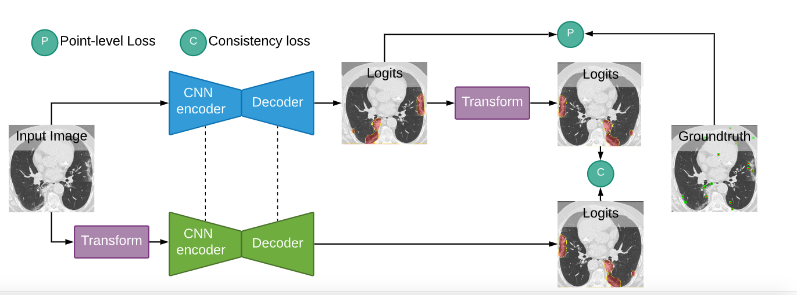

# A Weakly Supervised Consistency-based Learning  Method for COVID-19 Segmentation in CT Images [[Paper]](https://arxiv.org/abs/2007.02180)
## Accepted at WACV2021 Conference. Try the code in this [colab.](https://colab.research.google.com/drive/1UvSUqjDiEGrTg6FraZMKrBYNalyHPMJI?usp=sharing#scrollTo=S6m1RkAL6xUe)


## 1. Download Datasets

### COVID19

- https://drive.google.com/open?id=1bbKAqUuk7Y1q3xsDSwP07oOXN_GL3SQM

### COVID19 V2

- https://s3.ca-central-1.amazonaws.com/ubccic.covid19.models/L3netDemoData.zip

### COVID19 V3

- https://zenodo.org/record/3757476#.XtU6wC2ZOuV (create directories: CT, Lung_Mask, Infection_Mask)

## 2. Train & Validate



Run the following command to reproduce the experiments in the paper:

```
python trainval.py -e weakly_covid19_${DATASET}_${SPLIT} -sb ${SAVEDIR_BASE} -d ${DATADIR} -r 1
```

The variables (`${...}`) can be substituted with the following values:

- `DATASET` (the COVID dataset): `v1`, `v2`, or `v3`
- `SPLIT` (the dataset split): `mixed_c2`, `sep_c2`
- `SAVEDIR_BASE`: Absolute path to where results will be saved
- `DATADIR`: Absolute path containing the downloaded datasets

Experiment hyperparameters are defined in `./exp_configs/weakly_exps.py`

### 3. Visualize the Results

Open `results.ipynb` for visualization.

<p align="center" width="100%">

</p>


## Cite
```
@article{laradji2020weakly,
  title={A Weakly Supervised Consistency-based Learning Method for COVID-19 Segmentation in CT Images},
  author={Laradji, Issam and Rodriguez, Pau and Manas, Oscar and Lensink, Keegan and Law, Marco and Kurzman, Lironne and Parker, William and Vazquez, David and Nowrouzezahrai, Derek},
  journal={arXiv preprint arXiv:2007.02180},
  year={2020}
}
```
